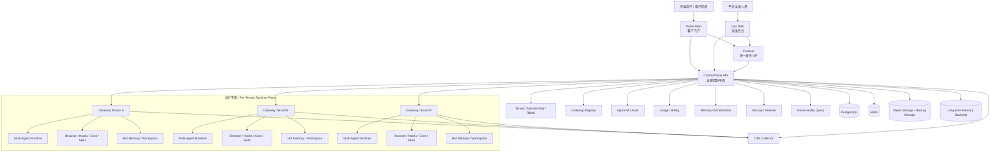
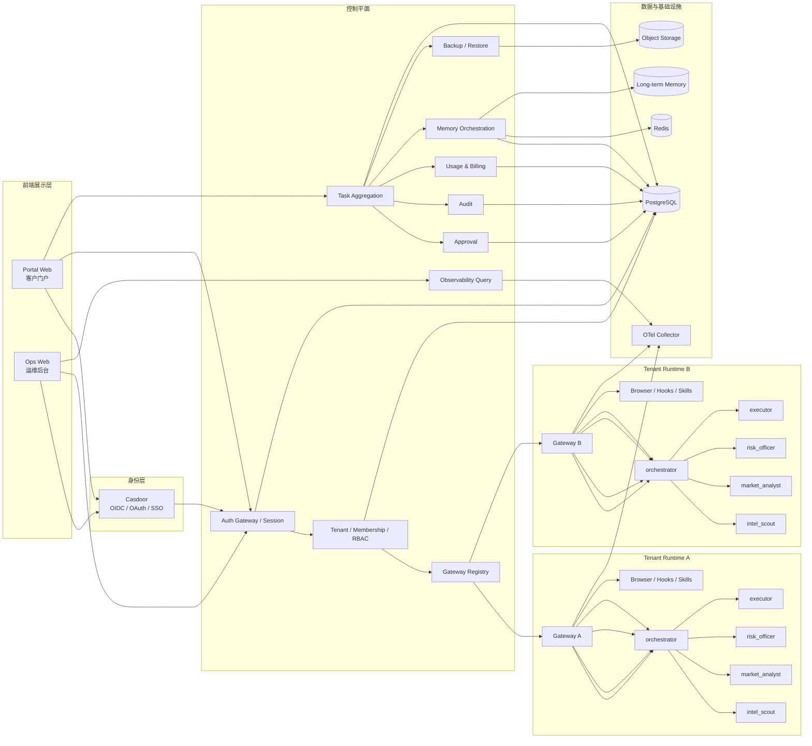
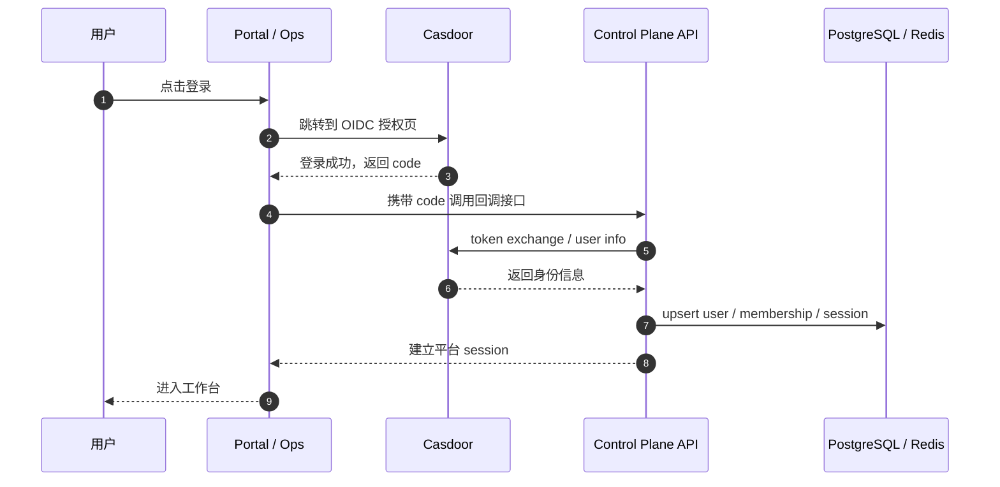
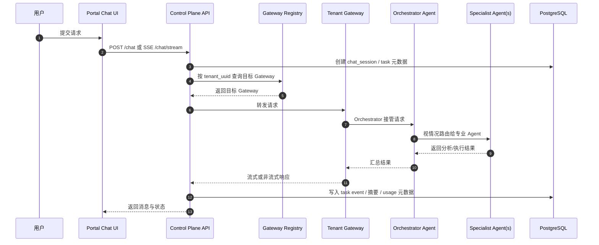
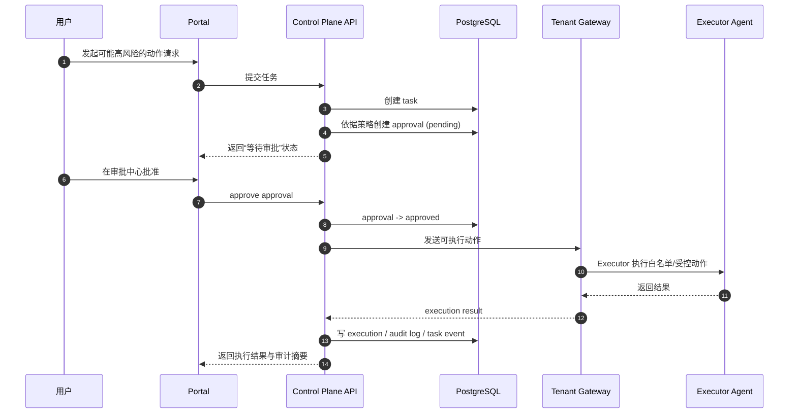
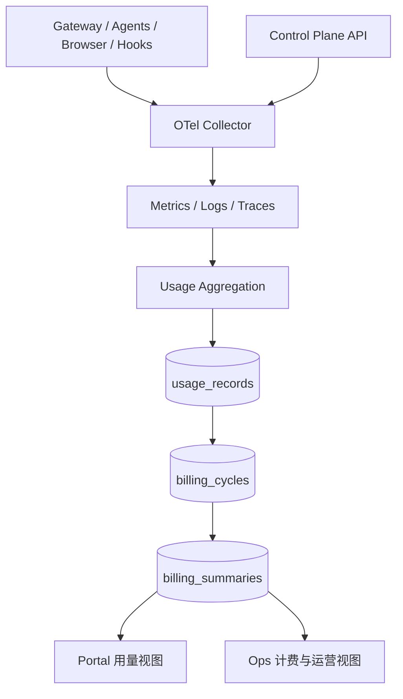
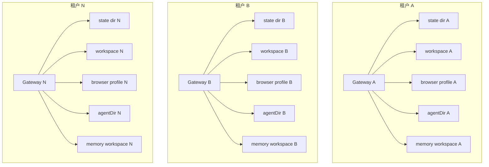
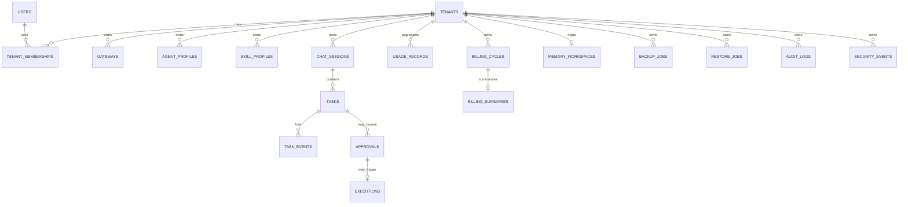
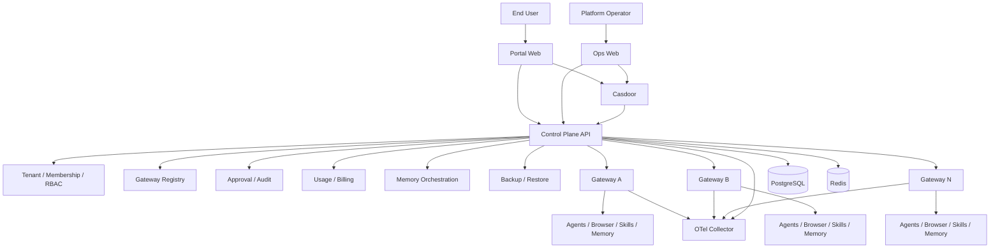

<div align="center">

# Web3 AI Super Assistant Platform

**多租户 Web3 超级助理平台**  
**Web3 AI Super Assistant Platform(W3-ASAP)**

<p>
  <a href="#zh-cn">🇨🇳 中文</a> ·
  <a href="#en-us">🇺🇸 English</a>
</p>

<p><strong>当前正式路线：</strong> Casdoor 统一身份 + 自建控制平面 + 每租户独立 OpenClaw Gateway 运行平面</p>

</div>

---

<a id="zh-cn"></a>

# 🇨🇳 中文

## 1. 项目简介

Web3 AI Super Assistant Platform (W3-ASAP)是一个**面向多租户长期运营**的 Web3 智能助理平台。

它不是一个简单的聊天页面，也不是单个 OpenClaw 实例的包装壳。项目的目标，是围绕 **控制平面（Control Plane）** 与 **运行平面（Runtime Plane）** 构建一套可持续演进、可审计、可扩租户、可分层治理的产品化平台。

平台核心能力包括：

- 多租户隔离与统一身份接入
- 每租户独立 Gateway 运行空间
- 多 Agent 协作与任务编排
- 审批优先的高风险动作控制
- 任务、审批、执行、审计链路沉淀
- Usage / Billing 聚合与运营可视化
- 记忆、备份、恢复、观察性等长期运营能力

> 说明：
> - 聊天组件使用 **自研聊天 UI 组件**

---

## 2. 项目要解决的问题

传统“单实例 + 单用户 + 单聊天界面”的 AI 工具，通常存在以下问题：

1. 无法同时服务多个客户租户
2. 无法清晰划分身份、权限、审批、执行边界
3. 运行时与平台管理混杂，难以运维
4. 无法为不同租户提供独立的浏览器状态、记忆空间、配置与审计视图
5. 无法形成平台级的 usage、billing、backup、audit 能力

本项目通过双平面分层和每租户独立运行实例，解决上述问题。

---

## 3. 当前正式架构路线

### 3.1 固定结论

当前项目的正式路线如下：

- **身份层**：Casdoor 作为统一 IdP
- **控制平面**：自建平台后端，负责租户、权限、审批、审计、计费、监控、记忆编排等能力
- **运行平面**：每租户独立 OpenClaw Gateway
- **前端层**：客户门户 + 运维后台，Tabler UI 外壳
- **聊天组件层**：自研聊天组件层
- **可观测层**：OTel Collector + 后续指标/日志/追踪聚合

### 3.2 明确不走的路线

以下内容不是当前正式路线：

- 不是多个租户共享同一个 Gateway 仅靠逻辑隔离
- 不是前端直接连接多个 Gateway 承担业务真相源
- 不是默认开放高风险自动执行
- 不是在第一阶段构建复杂量化交易系统

---

## 4. 核心设计原则

### 4.1 双平面原则

系统严格区分：

- **控制平面（Control Plane）**
- **运行平面（Runtime Plane）**

控制平面负责平台级治理与聚合；运行平面负责租户内部实际执行。

### 4.2 每租户独立 Gateway

每个租户拥有独立的：

- Gateway 实例
- state directory
- workspace
- agent 目录
- browser profile
- secrets / env
- memory workspace
- 观测标签 / 日志命名空间

### 4.3 统一身份，不自造第二套核心 IdP

所有正式登录都通过 Casdoor 或 Casdoor 信任链路完成。

### 4.4 tenant_uuid 是一级租户键

`tenant_uuid` 是全系统稳定的一级租户标识，用于：

- 配置映射
- 计费聚合
- 记忆空间映射
- 资源命名
- 日志归集
- 备份与审计边界

### 4.5 审批优先

凡涉及以下动作，默认进入审批或白名单策略：

- 钱包签名
- claim / approve / swap / bridge / transfer
- 合约交互
- 敏感网页提交
- 外部账号绑定
- 高风险站点操作

### 4.6 最小权限

Agent、用户、服务、工具都必须遵守最小权限边界，分析、执行、审批、风控、记忆管理等能力不能混为一体。

---

## 5. 整体架构总览



### 5.1 架构理解方式

可以把系统理解成两层：

#### 上层：控制平面
负责“平台管理与聚合”，回答这类问题：

- 这个用户是谁，属于哪个租户？
- 当前租户对应哪个 Gateway？
- 某个任务是否需要审批？
- 今日 token 使用量是多少？
- 哪个租户 Gateway 异常？
- 哪个租户需要备份、恢复或安全排查？

#### 下层：运行平面
负责“租户内部实际执行”，回答这类问题：

- 当前这条用户请求由哪个 Agent 接手？
- 是否需要调用浏览器、技能、Hooks 或 Cron？
- 会话上下文与热记忆如何承接？
- 实际执行结果是什么？

---

## 6. 逻辑分层详解

### 6.1 身份层（Identity Layer）

- Casdoor
- OIDC / OAuth / SSO
- 用户与组织模型
- 登录回调与 token 交换
- 控制平面本地 session 建立

### 6.2 前端展示层（Frontend Layer）

包含两个正式前端：

- `portal-web`：客户门户
- `ops-web`：运维后台

前端职责：

- 页面展示
- 用户交互
- 审批入口
- 状态视图
- 与控制平面 API 通信

前端**不应**承担：

- 平台业务真相源
- 权限最终判定
- 多租户真实隔离边界

### 6.3 控制平面 API 层（Control Plane API）

控制平面是平台业务中枢，负责：

- 租户与成员关系
- 登录态与权限上下文
- Gateway 选择与路由
- 任务聚合
- 审批流
- 审计日志
- usage 聚合与 billing 汇总
- 记忆编排
- 备份与恢复编排
- 观测数据查询

### 6.4 运行接入层（Gateway Access Layer）

控制平面按租户上下文，将请求路由到正确的 Gateway。

这一层通常包括：

- 反向代理
- tenant → gateway 映射
- trusted proxy / internal service routing
- 统一 header / context 透传策略

### 6.5 OpenClaw Runtime 层（Per-Tenant Runtime）

每个租户独立运行一个 Gateway，承接：

- Agent runtime
- 多 Agent 协作
- 工具 / 技能调用
- 浏览器动作
- Hooks / Cron / Standing Orders
- 局部热记忆
- 执行结果生成

### 6.6 观测层（Observability Layer）

- OTel Collector
- metrics / logs / traces
- 平台级查询与告警入口
- usage 归集基础数据

### 6.7 存储与支撑层（Data & Support Layer）

- PostgreSQL：平台业务数据库
- Redis：短期状态 / session / hot memory 辅助能力
- Object Storage：备份、导出、归档
- Long-term Memory Backend：长期记忆或摘要索引后端

---

## 7. 详细架构图：分层与模块职责



---

## 8. 关键业务链路

### 8.1 登录链路



### 8.2 聊天与任务链路



### 8.3 审批与执行链路



### 8.4 Usage / Billing / Observability 链路



---

## 9. 多租户隔离拓扑图



### 9.1 隔离红线

以下内容不得跨租户共享：

- Gateway 实例
- 状态目录
- workspace
- browser profile
- agent 目录
- secrets
- memory workspace
- 审计视图
- usage 聚合标签

---

## 10. 平台核心模块说明

### 10.1 Auth Gateway / Session 模块

负责：

- OIDC 登录回调
- 当前用户识别
- 当前租户识别
- 本地 session 建立
- 权限上下文装配

### 10.2 Tenant / Membership / RBAC 模块

负责：

- tenant 管理
- tenant_uuid 管理
- Casdoor 组织映射
- 用户与租户关系
- 平台角色 / 租户角色 / 权限检查

### 10.3 Gateway Registry 模块

负责：

- 记录租户 → Gateway 映射
- 状态、版本、配置版本
- 健康信息与最后心跳
- 目标 Gateway 路由选择

### 10.4 Agent Topology 模块

负责：

- 每租户 agent profile
- agent 启用状态
- skill / tool policy
- approval policy profile
- memory policy profile

### 10.5 Task Aggregation 模块

负责：

- 平台侧任务视图
- session / task / task events 聚合
- 对前台和后台提供统一任务查询

### 10.6 Approval 模块

负责：

- 待审批动作记录
- 审批状态机
- 批准 / 驳回
- 审批与执行的关联
- 审批审计

### 10.7 Usage & Billing 模块

负责：

- token 统计
- cost 估算
- browser task 统计
- execution 次数统计
- billing cycle / summary 汇总

### 10.8 Memory Orchestration 模块

负责：

- 热记忆策略
- 摘要压缩
- 长期记忆写入编排
- memory workspace 映射
- 导出 / 删除 / 归档策略

### 10.9 Backup / Restore 模块

负责：

- 备份任务
- 恢复点管理
- 恢复任务
- 备份审计

### 10.10 Audit / Security 模块

负责：

- 敏感动作日志
- 审批日志
- 安全事件
- 配置变更日志
- 租户级审计查询

---

## 11. 默认 Agent 角色模型

每个租户默认至少具备以下角色：

- `orchestrator`
- `intel_scout`
- `market_analyst`
- `airdrop_hunter`
- `risk_officer`
- `executor`
- `memory_billing_clerk`

可根据实现增加一个主入口 / main agent，但不应退化成“所有职责都塞给单一大 agent”。

### 11.1 角色职责建议

| Agent | 主要职责 |
|------|----------|
| orchestrator | 总控、任务拆分、上下文整合、统一输出 |
| intel_scout | 项目动态、公告、站点信息、情报收集 |
| market_analyst | 行情、组合、钱包、资产视图分析 |
| airdrop_hunter | 空投资格检查、任务清单、机会扫描 |
| risk_officer | 风险检查、站点安全、行为风险判定 |
| executor | 审批后低风险受控动作执行 |
| memory_billing_clerk | 摘要整理、记忆压缩、usage / billing 辅助归集 |

---

## 12. 数据模型总览

平台数据库是**控制平面数据库**，它的职责是保存：

- 元数据
- 映射关系
- 索引
- 摘要
- 审计链路

它**不是**以下内容的第一真相源：

- OpenClaw Gateway 内部详细运行状态
- 原始浏览器 profile 文件
- 原始 traces / logs / metrics 全量数据
- 大文件备份实体
- 长期记忆全文索引本体

### 12.1 核心实体概览



### 12.2 数据模型设计重点

- 核心表都必须可追溯到 `tenant_uuid`
- 配置与运行快照分离
- 聚合与原始事件分离
- 元数据与正文分离
- 审批与执行必须可追溯

---

## 13. 前端产品结构

### 13.1 客户门户（Portal Web）

建议核心页面：

- 工作台（Dashboard）
- 聊天工作区（Chat）
- 审批中心（Approvals）
- 情报中心（Intel）
- 历史与报告（History）
- 用量与账单摘要（Usage）

### 13.2 运维后台（Ops Web）

建议核心页面：

- 租户总览
- 租户详情
- Gateway 监控页
- Agent 仪表盘
- 审计与风控
- 记忆与备份中心
- 计费中心

### 13.3 聊天组件层说明

聊天组件层的职责是：

- 消息流界面
- 输入框
- 会话列表
- 消息呈现组件
- SSE / 流式消息交互承载

聊天组件层**不是**：

- 业务状态真相源
- 审批引擎
- 平台权限系统
- 运行平面替代品

因此，项目文档统一使用：

**ChatScope 或等价自研聊天组件层**

---

## 14. 目录结构说明

```text
apps/
  portal-web/                  # 客户门户
  ops-web/                     # 运维后台

services/
  control-plane-api/           # 控制平面 API
  openclaw-gateway-template/   # Gateway 标准模板
  openclaw-gw-<tenant>/        # 每租户独立 Gateway

packages/
  shared-types/                # 共享类型
  shared-config/               # 共享配置
  ui-kit/                      # UI 组件
  chat-components/             # 聊天 UI 组件或封装
  i18n/                        # 国际化字典与辅助逻辑（如启用）

docs/
  PROJECT_CONSTITUTION.md      # 最高优先级约束文件
  SYSTEM_BLUEPRINT.md          # 实施级系统蓝图
  SCOPE_GUARDRAILS.md          # 防跑偏护栏
  DATA_MODEL.md                # 数据模型蓝图
  EXECUTION_BACKLOG.md         # 项目工单总台账
  policies/                    # 策略文件
  adr/                         # 架构决策记录

infra/
  docker/                      # 容器编排
  nginx/                       # 反向代理配置
  otel/                        # OTel Collector 配置
  scripts/                     # 基础设施相关脚本

scripts/                       # 开发 / 运维脚本

db/
  migrations/                  # 迁移工程
  schema/                      # SQL schema / DDL
  seeds/                       # 种子数据
```

---

## 15. 安全边界与敏感信息原则

只描述整体架构与模块边界，**不暴露以下敏感信息**：

- 真实密钥、口令、token
- 内网地址、私有凭证、运维账户
- 真实租户数据
- 真实生产表结构细节中的敏感字段取值
- 生产域名证书、代理 header 细节、私有端口规划
- 任何可直接用于攻击、越权、旁路或绕过审批的实现细节

---

## 16. 建议域名规划（示意）

| 子域名 | 用途 |
|-------|------|
| `auth.<domain>` | Casdoor 统一身份入口 |
| `app.<domain>` | 客户门户 |
| `ops.<domain>` | 运维后台 |
| `api.<domain>` | 控制平面 API |
| `gw-<tenant-slug>.<domain>` | 租户 Gateway 入口 |

---

## 17. 实施阶段建议

### 第一阶段：可交付骨架

重点完成：

- 文档总纲
- monorepo 工程骨架
- 身份与租户核心模型
- 门户与后台基础壳
- 每租户独立 Gateway 模板
- 任务 / 审批 / 执行主链路骨架
- usage / billing / memory / backup / audit 的基础对象与页面

### 第二阶段：主链路跑通

重点完成：

- 真正多 Agent 编排
- 审批 → 执行 → 审计闭环
- 真实 Web3 只读 Skills
- 记忆分层与压缩策略
- usage 自动归集
- 最小冒烟测试与回归验证

### 第三阶段：运营增强

重点完成：

- 更成熟的观察性面板
- 策略中心
- 备份恢复增强
- 导出 / 删除能力
- 多语言完善
- 更强的租户运营视图

---

## 18. 文档优先级

当 README 与正式文档冲突时，以以下文件为准：

1. `docs/PROJECT_CONSTITUTION.md`
2. `docs/SYSTEM_BLUEPRINT.md`
3. `docs/SCOPE_GUARDRAILS.md`
4. `docs/DATA_MODEL.md`
5. `docs/EXECUTION_BACKLOG.md`

README 的作用是帮助读者快速理解整体思路，不替代正式约束文档。

---

## 19. 快速理解一句话总结

这是一个：

> **以 Casdoor 统一身份、以自建控制平面负责平台治理、以每租户独立 OpenClaw Gateway 承接运行时、以审批优先和多租户隔离为核心边界的 Web3 智能助理平台。**

---

<a id="en-us"></a>

# 🇺🇸 English

## 1. Overview

Web3 Super Assistant Platform is a **multi-tenant, product-oriented Web3 assistant platform** built around a strict separation between:

- **Control Plane** for platform governance
- **Runtime Plane** for per-tenant execution

It is **not** a simple chat UI wrapper, and **not** a shared single-runtime setup.

### Current official direction

- **Identity**: Casdoor as the unified IdP
- **Control Plane**: self-built platform backend
- **Runtime Plane**: one independent OpenClaw Gateway per tenant
- **Frontend Shell**: Tabler-style UI shell
- **Chat UI Layer**: ChatScope or equivalent self-built chat component layer
- **Observability**: OTel Collector and later aggregation

### Explicit non-directions

- LibreChat is **not** part of the current official architecture direction
- ChatScope is **not** the only allowed implementation
- Shared multi-tenant Gateway runtime is **not** allowed
- Frontend is **not** the source of truth for platform business logic

---

## 2. Core Principles

1. Control Plane / Runtime Plane separation
2. One Gateway per tenant
3. Casdoor as unified IdP
4. `tenant_uuid` as the first-class tenant key
5. Approval-first for high-risk actions
6. Least privilege for agents, users, tools, and services
7. Product-grade extensibility instead of hardcoding for a few users

---

## 3. High-Level Architecture



---

## 4. Layered Model

### Identity Layer
- Casdoor
- OIDC / OAuth / SSO
- login callback and user mapping
- platform session established by control plane

### Frontend Layer
- `portal-web`
- `ops-web`
- Tabler-style shell
- self-built or equivalent chat UI components

### Control Plane
- tenant management
- membership / RBAC
- gateway routing
- task aggregation
- approval / audit
- usage / billing
- memory orchestration
- backup / restore
- observability query

### Runtime Plane
- one Gateway per tenant
- multi-agent runtime
- browser / hooks / skills
- hot memory and workspace context

### Data & Infra
- PostgreSQL
- Redis
- object storage
- long-term memory backend
- OTel Collector

---

## 5. Tenant Isolation

Each tenant must have isolated runtime resources, including:

- Gateway instance
- state directory
- workspace
- browser profile
- agent directory
- secrets
- memory workspace
- usage / audit boundary

Cross-tenant sharing of these runtime resources is not allowed.

---

## 6. Chat UI Positioning

The project uses the wording:

**ChatScope or equivalent self-built chat component layer**

This means the chat UI layer is responsible for:

- message rendering
- chat input
- session list
- streaming response UI

It is **not** responsible for:

- business truth
- approval engine
- permission system
- runtime orchestration itself

---

## 7. Data Model Philosophy

The platform database stores:

- metadata
- mappings
- indexes
- summaries
- audit chains

It is **not** the primary source of truth for:

- internal Gateway runtime state details
- raw browser profile files
- full raw observability payloads
- large backup file bodies
- full long-term memory index bodies

---

## 8. Recommended Documentation Order

When this README conflicts with formal project documents, follow this priority:

1. `docs/PROJECT_CONSTITUTION.md`
2. `docs/SYSTEM_BLUEPRINT.md`
3. `docs/SCOPE_GUARDRAILS.md`
4. `docs/DATA_MODEL.md`
5. `docs/EXECUTION_BACKLOG.md`

---

## 9. One-Sentence Summary

This is a **multi-tenant Web3 assistant platform** built with **Casdoor for identity**, a **self-built control plane for governance**, and **one isolated OpenClaw Gateway per tenant for runtime execution**, with **approval-first** and **tenant isolation** as non-negotiable boundaries.

